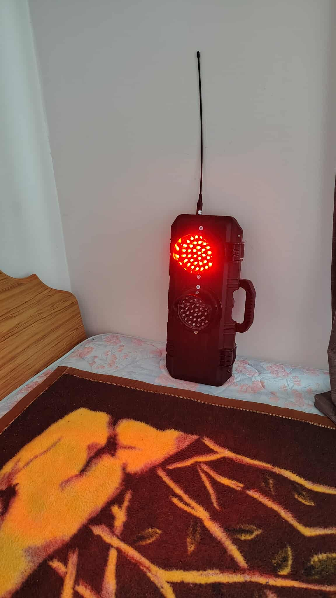
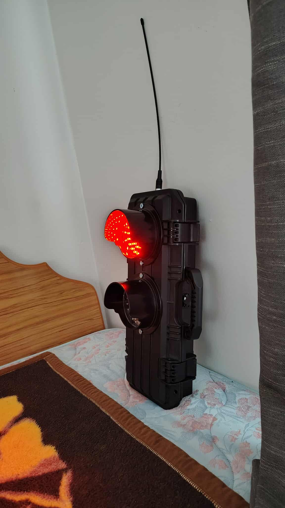
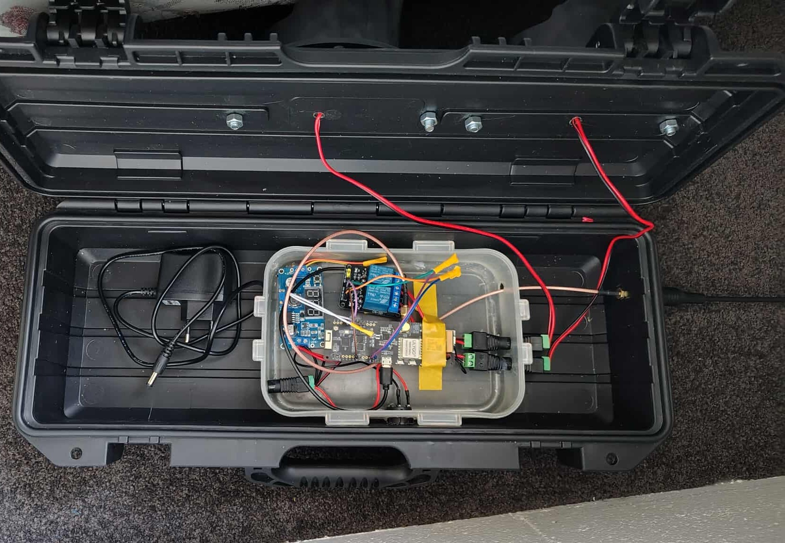
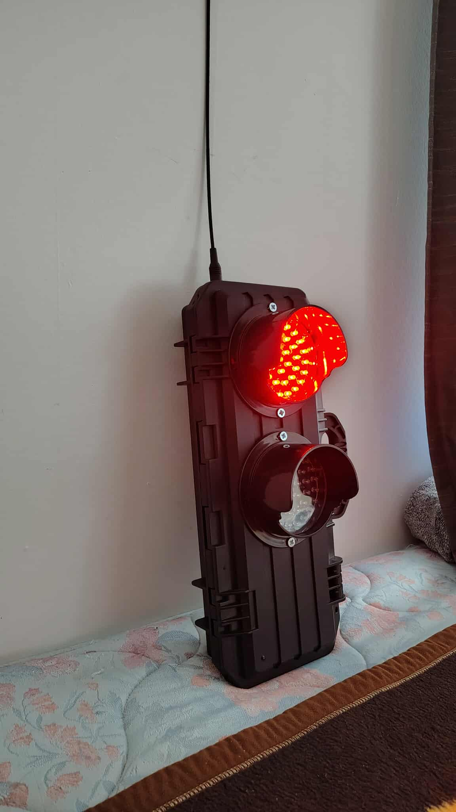
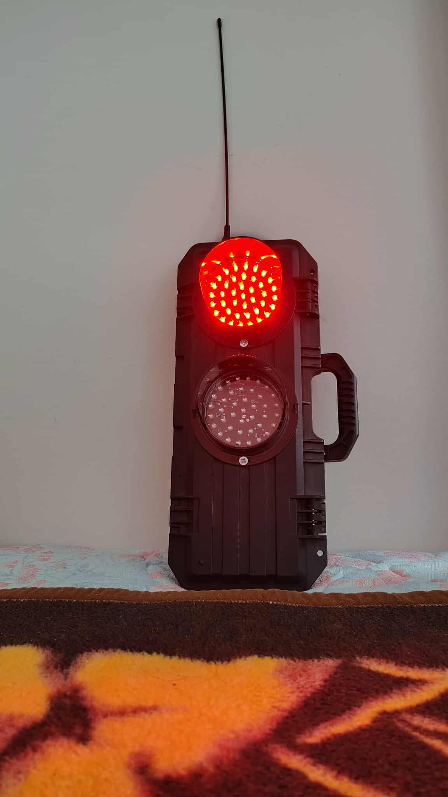

# Remote Traffic Lights with LoRa

## Overview

This project implements a portable, remote-controlled **traffic light system** designed for **Temporary Traffic Management (TTM)** zones in **New Zealand**. It uses **two LoRa-enabled microcontrollers**—the **XIAO ESP32S3** (transmitter) and the **Lilygo T-Beam** (receiver)—to wirelessly control traffic lights **without any internet or Wi-Fi connection**.

The system uses **only Red and Green lights**, mirroring the manual stop/go paddles commonly used in TTM sites with a 30 km/h speed limit. This makes it suitable for deployment in remote, hazard-prone, or network-limited environments.

---

## ℹ️ Why Only Red and Green?

New Zealand’s Temporary Traffic Management standards for low-speed zones (typically 30 km/h) use only **Red** and **Green** lights. Amber/Yellow lights are omitted because drivers are expected to stop immediately when the red light shows, minimizing hesitation and confusion.

---

## 🖼️ Project Images

Below are some snapshots of the setup:

  
*Transmitter (XIAO ESP32S3) wired and ready to send.*

  
*Receiver (Lilygo T‑Beam) with LEDs and breadboard.*

  
*Traffic Light Body*

  
*Traffic Light Body*

  
*Traffic Light Electronics components*

  
*Traffic Light Body*

  
*Traffic Light Body*

---

## 🎥 Project Video

Watch a demo of the system in action:

[](https://youtube.com/shorts/X4vUCieE72s)

---

## Features

- ✅ **Fully Offline:** Operates without Wi-Fi or internet  
- 📡 **LoRa Communication:** Long-range, low-power radio control  
- 🟥🟩 **Red and Green Lights Only:** Following NZ TTM standards  
- 🔋 **Portable & Battery Friendly:** Ideal for field use  
- 🛠️ **Optional Adafruit IO Integration:** For simulation/testing only  

---

## Hardware Requirements

- **XIAO ESP32S3** – Transmitter microcontroller  
- **Lilygo T-Beam** – Receiver microcontroller  
- **LEDs** – Red and Green only  
- **Resistors** – 220–330 Ω current-limiting  
- **Breadboard & Jumper Wires** – For prototyping  
- **Power Source** – USB battery pack or similar  

---

## Software Requirements

- **Arduino IDE**

## Required Libraries

- **Arduino LoRa**  
- **SPI**

---

## Installation Steps

1. Clone the repository:

   ```bash
   git clone https://github.com/caringalml/remote-traffic-lights-with-lora-.git
